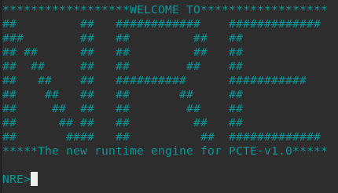

# NRE_v1.0

The project needs to be downloaded or cloned from this repository.

The <b>NRE.sh</b> script provides you with the installation of chromedriver and geckodriver as well as the inclusion of the project in the user's path.
That way the engine can be invoked by typing 'nre' anywhere in the console. It also ensures that console parameters are passed to the java application.

<b><u>Prerequisites:</u></b>
- JDK installed on your system.
<br>installing JDK on <a href=https://www.digitalocean.com/community/tutorials/how-to-install-java-with-apt-on-ubuntu-18-04>LINUX</a>
<br>installing JDK on <a href=https://linuxize.com/post/install-java-on-debian-10/>DEBIAN</a>
<br>installing JDK on <a href=https://docs.oracle.com/en/java/javase/15/install/installation-jdk-macos.html>MAC_OS</a>
- xvfb installed on your system.
<br><a href=https://docs.oracle.com/health-sciences/empirica-signal-90/ESIIU/224173.htm>installing Xvfb</a>

<b><u>Instalation Steps:</u></b>
- Download the project as a zip folder and unzip it in your system or clone it directly from this repository.
- Navigate to project folder <b><u>(NRE)</u></b> in your system's terminal (<em>Linux distibution recommended</em>).
- Execute the following command with administrator priviledges: 
  <div class="text-white bg-gray-dark mb-2">
   sudo chmod +x NRE.sh
  </div> 
- Execute the script with administrator priviledges:
  <div class="text-white bg-gray-dark mb-2">
   sudo bash NRE.sh
  </div> 
  
  That's it!<br>
  <br>
   
<br>
<b><u>Usage and Parameters</u></b>
<pre>   
  -Project Path: (mandatory parameter)
<i>The project path is the path to the test automation project where all of the files required to execute a test suite are stored.
The project path is an absolute path.</i>
<br>
  -Test Suite Path: (mandatory parameter)
<i>The test suite path is the relative path containing the test suite files.
The test suite path is a relative path from the project path.
the test suite path is used either for test suites allocating test cases or test collections that allocates test suites.</i>
<br>
  -Report Folder: (optional parameter)
<i>The desired directory for storing the generated reports can be entered. (absolute path recommended)
Default path for reports is ./NRE/NRE_Reports</i>
<br>
  -Execution Profile: (optional parameter)
<i>The execution profile is the name of the profile selected to run with the test suite.
Default profile is applied if -executionProfile parameter is omitted.</i>
<br> 
 -Browser Type: (optional parameter)
<i>The browser type specifies which browser to execute the tests in along with determing if the program should run in a headless state.
	Currently supported browsers:
	[Chrome | Firefox | Edge | Opera | Chrome(headless) | Firefox(headless)]
	Chrome(headless) is set as default browser if -browser parameter is omitted.</i>
<br>
 -Failure Handling: (optional parameter)
<i>The parameter controls the manner in which failures will be handled during execution.
There are currently three different ways to handle the failures:
	CONTINUE_ON_FAILURE (continue)	executes as much test as possible even if failure is encountered.	
	STOP_ON_FAILURE     (stop)	interrupt the execution upon encountering any failure. 
	OPTIONAL	     (optional)	similar to continue mode, but it mars failed test with a warning.
STOP_ON_FAILURE is set as default control if -failureHandling parameter is omitted.</i>
</pre>
<br>
  -EXAMPLE:<br>
'-projectPath=/media/psf/Home/Desktop/Projects/new_prj/PCTE -testSuitePath=Test Suites/9001-9500 Smoke/S9001 All Smoke Tests -browserType=firefox -executionProfile=Authentication -failureHandling=continue -reportFolder=/media/psf/Home/Desktop/Reports'
<br><br>
-Output<br>
<i>After a test suite has been run an html report will be generated detailing the number of successful and unsuccessful test cases.
If a test case is unsuccessful there will be additional information detailing why that test case failed. In most cases screen captures will be included.
  This report can be accessed under the report folder.</i>
 <br>  
   
   ```diff
   !Good Luck!
